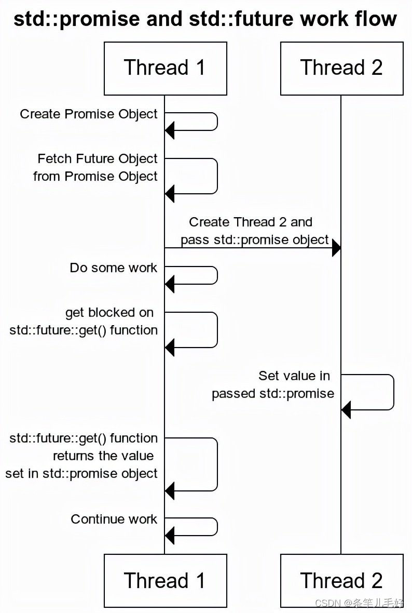

# Synchronizing concurrent operations
## **`std::condition_variable`**
### **`std::condition_variable` && `std::condition_variable_any`**

std::condition_variable 只能与 std::mutex 同时使用（preferred）

std::condition_variable_any 可以与 任何 mutex-like  mutex 使用，所以他有额外开销

### **`notify_one()` && `wait()`**

> 当条件不满足的时候， `wait()` 解锁 并让程序阻塞（因为如果不解锁， 其它线程就无法加锁）
当条件满足的时候加锁

> `notify_one()`必须与`std::unique_lock()`配合使用，因为`wait()` 会重复加锁解锁。

### **`notify_one()` && `notify_all()`**

## **`std::future`**

std::future 不提供线程同步机制， 需要加锁或其它来保护

#### **`std::future` && `std::condition_variable`**

`std::future` `std::promise` 只等一次

event 发生之后， future 不可重置。

### **`std::async`**
参数传入方式，引用，非引用
#### ***`std::lunch`***

### ***`std::packaged_task`***
### ***`std::promise`***

### `std::async` `std::packaged_task` `std::promise` compare
#### `std::async`
> Pass in a function object `fn` and retrieve the return value of fn through `std:: future:: get()`

> no need to lunch `std::thread`

#### `std::packaged_task`
It is similar to std::function, but transferring its result automatically to a future object
#### `std::promise`

### ***std::future exception***

exception 可以存储到 `std::future` 中，
同时`std::promise()` 调用 `set_value()`来存储异常

### ***std::shared_future***